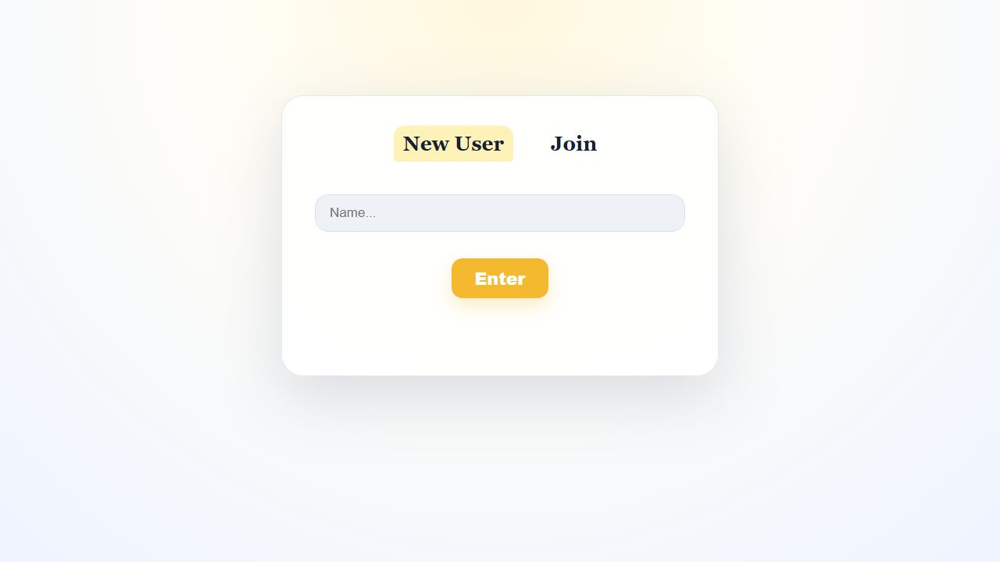
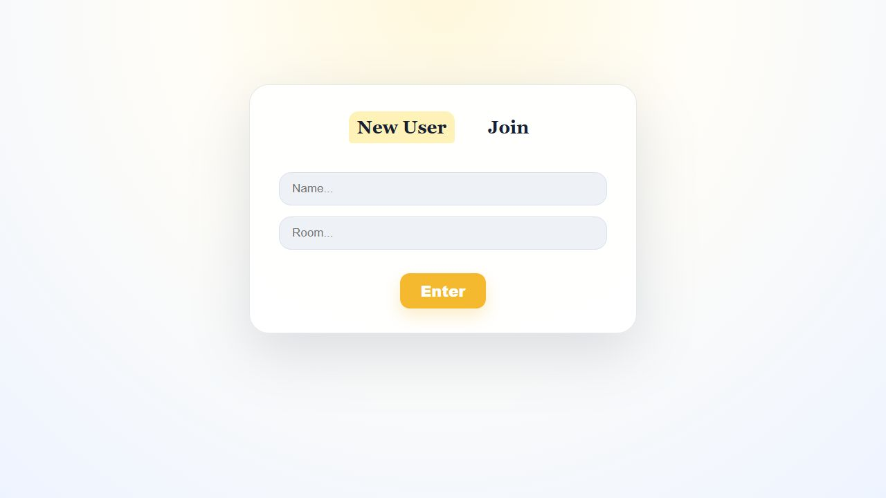
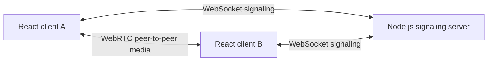

# HopeOn

HopeOn is a lightweight, two-person video calling application built with React, TypeScript, WebRTC, and a custom WebSocket signaling server. The server coordinates room membership and exchanges SDP offers, answers, and ICE candidates; audio/video media travels directly between peers.

## Preview

### Create a room



### Join an existing room



## Features

- Create a new two-person calling room or join an existing room ID
- Establish peer-to-peer connections with the browser WebRTC APIs
- Exchange offers, answers, and ICE candidates over a custom WebSocket protocol
- Queue early signaling messages until the peer connection is ready
- Capture and display local and remote video streams
- Keep active users, rooms, offers, and ICE candidates in memory

## Architecture



The signaling server helps the browsers discover one another and negotiate a connection. Once negotiation succeeds, the media stream does not pass through the application server.

## Tech stack

- **Frontend:** React 19, TypeScript, Vite, Tailwind CSS
- **Realtime communication:** WebRTC and the native WebSocket API
- **Backend:** Node.js, Express, TypeScript, `ws`
- **Connectivity:** Google STUN server (`stun:stun.l.google.com:19302`)

## Project structure

```text
HopeOn/
├── frontend/                 # React client
│   └── src/
│       ├── components/
│       │   ├── WelcomePage.tsx
│       │   └── Conversation.tsx
│       ├── App.tsx
│       └── main.tsx
├── backend/                  # WebSocket signaling server
│   └── src/
│       ├── managers/
│       │   ├── RoomManager.ts
│       │   ├── SignallingServer.ts
│       │   └── UserManager.ts
│       └── server.ts
└── docs/screenshots/
```

## Getting started

### Prerequisites

- Node.js 20 or newer
- npm
- pnpm 11 or newer
- A browser with WebRTC and camera support

### 1. Start the signaling server

```bash
cd backend
pnpm install
pnpm dev
```

The WebSocket server listens on `http://localhost:3000`.

### 2. Start the frontend

In a second terminal:

```bash
cd frontend
npm install
npm run dev
```

Open the URL printed by Vite (normally `http://localhost:5173`) and allow camera access when prompted.

## Signaling flow

1. The first participant selects **New User**, enters a name, and creates a room.
2. The server assigns the participant and room IDs and marks that participant as the initiator.
3. The second participant selects **Join** and submits the same room ID.
4. The clients exchange an SDP offer/answer and ICE candidates through the signaling server.
5. The browsers establish the direct WebRTC media connection.

## Current limitations

- Rooms are limited to two participants and exist only in server memory.
- The generated room ID is not yet displayed in the interface; it is currently visible in the browser console.
- The signaling URL is hard-coded to `localhost:3000`.
- Only a public STUN server is configured. A production deployment should add a TURN server for restrictive networks.
- The current media constraints enable video but disable audio.

## Planned improvements

- Display and copy the generated room ID in the conversation view
- Configure signaling and ICE servers with environment variables
- Add microphone, camera, and leave-call controls
- Add a TURN server and production deployment configuration
- Add automated tests for room management and signaling messages

## License

This project is currently distributed under the ISC license declared by the backend package.
