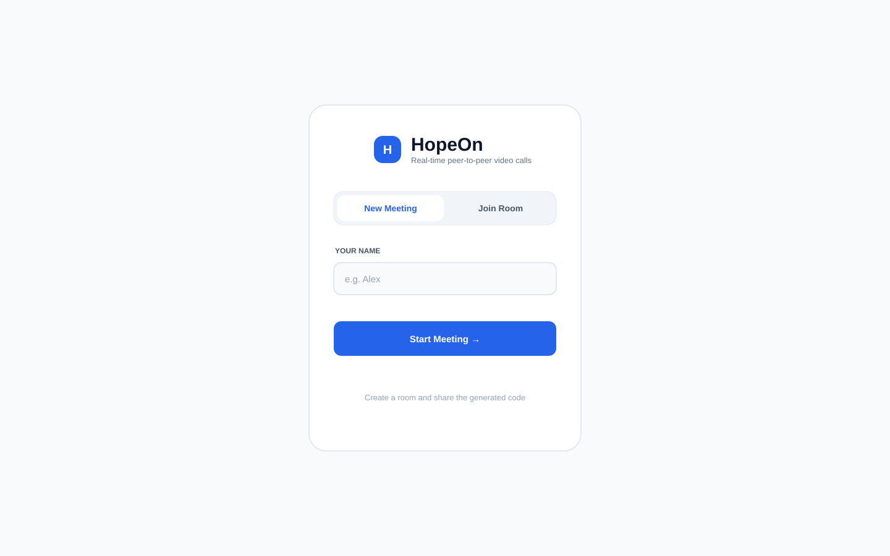
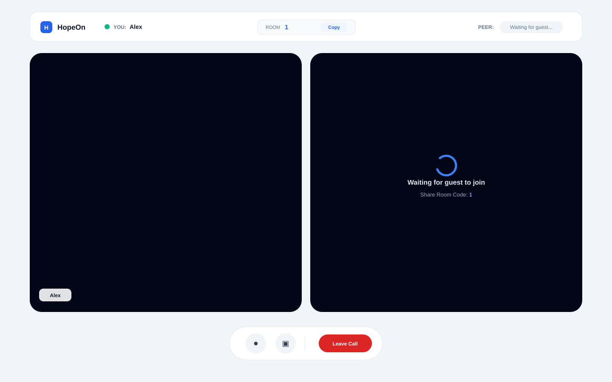
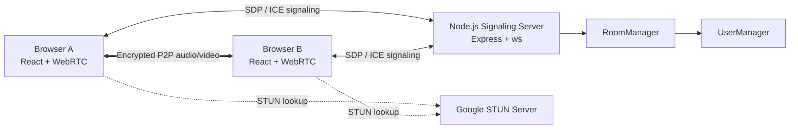
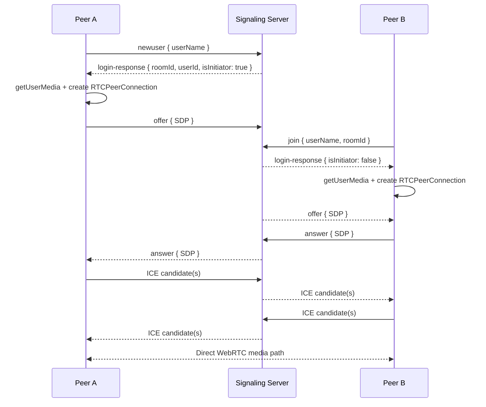

<div align="center">

# HopeOn

### Minimal 1:1 video calling built directly on WebRTC and WebSockets

A full-stack real-time communication project that implements the WebRTC signaling lifecycle without hiding it behind a third-party calling SDK.

[](https://react.dev/)
[](https://www.typescriptlang.org/)
[](https://webrtc.org/)
[](https://github.com/websockets/ws)
[](https://tailwindcss.com/)
[](https://vite.dev/)
[](https://expressjs.com/)

</div>

---

## Overview

**HopeOn** is a browser-based, two-participant video calling application built to understand and implement the mechanics behind real-time peer-to-peer communication.

Instead of using a managed video SDK, HopeOn uses the browser's native `RTCPeerConnection` and `getUserMedia()` APIs while a custom Node.js WebSocket server coordinates SDP offers/answers, ICE candidates, room membership, and peer disconnects.

The signaling server never carries the actual audio/video stream. Once negotiation succeeds, media is exchanged directly between browsers through WebRTC.

## UI

<p align="center">
  
</p>

<p align="center"><sub>Create a new meeting or join an existing room with a room code.</sub></p>

<p align="center">
  
</p>

<p align="center"><sub>Two-participant call stage with room sharing, peer status, media controls, and call termination.</sub></p>

---

## Why this project exists

WebRTC can make video calling look deceptively simple from the outside. The difficult part is everything that happens before the media starts flowing: room coordination, peer discovery, SDP negotiation, NAT traversal, ICE candidate exchange, timing races, and cleanup.

HopeOn implements those pieces explicitly so the full connection lifecycle remains visible in the codebase.

### Engineering highlights

- **Native browser WebRTC** using `RTCPeerConnection`, `MediaStream`, and `getUserMedia()`.
- **Custom signaling protocol** over the lightweight `ws` WebSocket library — no Socket.IO and no managed RTC signaling SDK.
- **Two-user room lifecycle** with room creation, join validation, room capacity checks, and peer-leave notifications.
- **Offer/answer forwarding** through a dedicated signaling layer while media remains peer-to-peer.
- **ICE candidate buffering** on the server so candidates generated before a peer joins can still be delivered later.
- **Client-side signaling queue** to avoid processing offers/ICE candidates before the local `RTCPeerConnection` is ready.
- **Media controls** that toggle the underlying audio/video tracks instead of recreating the stream.
- **Connection cleanup** that stops local tracks, closes the peer connection, leaves the room, and closes the WebSocket.
- **Responsive meeting UI** built with Tailwind CSS, including room-code sharing and peer status feedback.

---

## Architecture



### Responsibility split

| Layer | Responsibility |
| --- | --- |
| **React client** | Meeting UI, local media capture, peer connection lifecycle, SDP generation, ICE handling, media controls |
| **WebSocket signaling server** | Receives signaling events and delegates room/peer coordination |
| **RoomManager** | Creates rooms, enforces the two-user limit, routes offers/answers and ICE candidates, handles departures |
| **UserManager** | Stores connected user metadata, WebSocket references, last SDP description, and buffered ICE candidates |
| **WebRTC** | Establishes the direct browser-to-browser media path |
| **STUN** | Helps peers discover network-reachable ICE candidates |

---

## WebRTC connection flow



The signaling channel is required to introduce the peers and exchange connection metadata. It is **not** used to transport the call media.

---

## Signaling protocol

HopeOn uses JSON messages with a small event-based protocol.

### Client → server

| Event | Purpose |
| --- | --- |
| `newuser` | Create a room and register the first participant |
| `join` | Join an existing room |
| `offer` | Send an SDP offer |
| `answer` | Send an SDP answer |
| `icecandidate` | Send a newly discovered ICE candidate |
| `leave` | Explicitly leave the current room |

### Server → client

| Event | Purpose |
| --- | --- |
| `login-response` | Returns `userId`, `roomId`, and whether the client is the initiator |
| `offer` | Relays the peer's SDP description |
| `offer-response` | Confirms that the SDP description was accepted for relay |
| `icecandidate` | Relays a peer ICE candidate |
| `ice-response` | Confirms ICE processing |
| `peer-left` | Tells the remaining participant that the other peer disconnected |
| `error` | Reports cases such as a missing or full room |

---

## Project structure

```text
HopeOn/
├── backend/
│   ├── src/
│   │   ├── managers/
│   │   │   ├── RoomManager.ts
│   │   │   ├── SignallingServer.ts
│   │   │   └── UserManager.ts
│   │   └── server.ts
│   ├── package.json
│   ├── pnpm-lock.yaml
│   └── tsconfig.json
│
└── frontend/
    ├── public/
    ├── src/
    │   ├── components/
    │   │   ├── Conversation.tsx
    │   │   └── WelcomePage.tsx
    │   ├── App.tsx
    │   ├── index.css
    │   └── main.tsx
    ├── package.json
    └── vite.config.ts
```

---

## Tech stack

### Frontend

- **React 19**
- **TypeScript 6**
- **Vite 8**
- **React Router**
- **Tailwind CSS 4**
- **Native WebRTC browser APIs**

### Backend

- **Node.js**
- **Express 5**
- **ws** WebSocket server
- **TypeScript**
- In-memory room and user managers

### Networking

- WebSocket signaling
- SDP offer/answer negotiation
- ICE candidate exchange
- Google public STUN: `stun:stun.l.google.com:19302`
- Direct peer-to-peer media transport after negotiation

---

## Run locally

### Prerequisites

- Node.js 20+
- npm
- pnpm 11+
- A modern WebRTC-capable browser
- Camera and microphone permissions

### 1. Start the signaling server

```bash
cd backend
corepack enable
pnpm install
pnpm dev
```

The signaling server listens on:

```text
ws://localhost:3000
```

### 2. Start the frontend

Open a second terminal:

```bash
cd frontend
npm install
npm run dev
```

Then open the Vite URL printed in the terminal, normally:

```text
http://localhost:5173
```

### 3. Test a call

1. Open HopeOn in two browser windows or two different browsers.
2. In the first window, enter a name and choose **Start Meeting**.
3. Copy the generated room ID.
4. In the second window, choose **Join Room**, enter a name and the room ID, and join.
5. Grant camera and microphone permission in both clients.

> For realistic WebRTC testing, using two devices on different networks exposes NAT behavior that two tabs on the same machine cannot reproduce.

---

## Interesting implementation details

### Signaling messages can arrive before WebRTC is ready

A peer can receive an SDP offer or ICE candidate while its local `RTCPeerConnection` is still being initialized. HopeOn keeps these messages in a client-side pending queue and drains them after the connection is ready.

```ts
const pendingMessages = React.useRef<{ type: string; data: any }[]>([])
```

This prevents signaling-order races from immediately becoming `setRemoteDescription()` or `addIceCandidate()` failures.

### ICE candidates are retained for late joiners

The server stores candidates associated with each user. When the second participant joins a room, previously discovered candidates can be replayed to that peer instead of being lost simply because they were generated early.

### Muting does not renegotiate the connection

The microphone and camera controls toggle `MediaStreamTrack.enabled`. That keeps the existing peer connection alive and avoids unnecessary renegotiation.

---

## Current scope and limitations

HopeOn is intentionally a **1:1 WebRTC prototype**, not yet a production conferencing service.

| Current behavior | Production consideration |
| --- | --- |
| STUN-only connectivity | Add **TURN** fallback for restrictive NAT/firewall environments |
| `ws://localhost:3000` is hard-coded | Move signaling URL to environment configuration and use **WSS** in production |
| Rooms/users live in process memory | Add persistent/shared state if signaling runs across multiple instances |
| Maximum of two users per room | Introduce an **SFU** architecture for scalable group calls |
| Incrementing room/user IDs | Use collision-resistant room identifiers and stronger access control |
| No authentication | Add authenticated users, signed room access, or invite tokens |
| No automated test suite | Add unit, signaling integration, and browser/WebRTC end-to-end tests |
| Single signaling process | Add health checks, observability, graceful shutdown, and horizontal scaling |

### Why an SFU would be the next architecture step

Pure peer-to-peer works well for a two-person call. For group calling, every participant would otherwise need to upload a separate stream to every other participant, making bandwidth and CPU costs grow quickly.

A future group-call version of HopeOn would move media routing to an **SFU (Selective Forwarding Unit)** while retaining a signaling/control plane around it.

---

## Roadmap

- [ ] Add TURN support and configurable ICE servers
- [ ] Move signaling and frontend endpoints to environment variables
- [ ] Add room invite URLs instead of manually copying numeric room IDs
- [ ] Add authentication / secure room access
- [ ] Add reconnect and connection-state recovery
- [ ] Add device selection for microphone and camera
- [ ] Add screen sharing
- [ ] Add WebRTC statistics and call-quality diagnostics
- [ ] Add automated signaling and browser tests
- [ ] Containerize frontend/backend
- [ ] Add production WSS + HTTPS deployment
- [ ] Explore SFU-based multi-user rooms

---

## What this project demonstrates

HopeOn is primarily an engineering project around **real-time systems and browser networking**. It demonstrates practical understanding of:

- WebRTC peer connection lifecycle
- SDP offer/answer negotiation
- ICE and STUN
- NAT traversal fundamentals
- WebSocket-based signaling
- asynchronous event ordering and race handling
- room/session lifecycle management
- browser media APIs
- real-time UI state
- cleanup of long-lived network and media resources

---

<div align="center">

Built to learn the parts of video calling that abstractions usually hide.

**[View the repository](https://github.com/animesh1798/HopeOn)**

</div>
